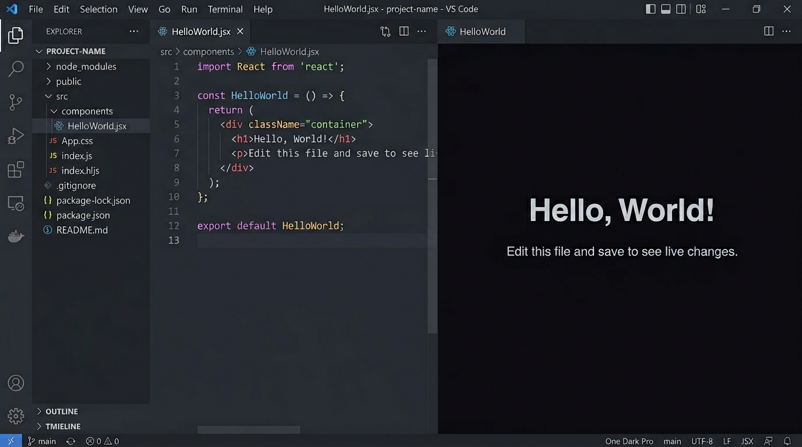

# JSX Preview — VS Code Extension

Live preview of JSX/TSX components in a VS Code webview panel. Save the file to refresh automatically.



## Features

- **Instant side-by-side preview** — renders your JSX/TSX component in a webview panel right next to the editor.
- **Auto-refresh on save** — the preview updates every time you save the file, or any file it imports (`.js`, `.jsx`, `.ts`, `.tsx`, `.css`, `.json`).
- **Zero config bundling** — uses esbuild under the hood with automatic JSX transform; no build pipeline setup required.
- **Works with your project's dependencies** — resolves `node_modules` from your project tree so components using third-party libraries render correctly. Falls back to the extension's bundled React if no local install is found.
- **Multiple previews** — open previews for several components at once, each in its own panel.
- **Multiple entry points** — right-click in the file explorer, right-click in the editor, use the editor title bar icon, or press **Cmd+Shift+J** / **Ctrl+Shift+J**.
- **Clear error overlay** — build errors are displayed inline in the preview panel with syntax-highlighted output.

### Terminal & pipeline integration

Components can trigger shell commands from the webview and stream results back into the panel:

- **Terminal execution** — send any shell command to a named VS Code terminal from the webview.
- **Live log streaming** — stdout and stderr are captured via `tee` and streamed line-by-line to both the webview and the "JSX Preview" Output Channel as the process runs.
- **Completion detection** — the exit code is captured automatically; the webview receives a `pipelineComplete` message with `exitCode` when the process finishes.
- **Stop/cancel** — send a `stopPipeline` message from the webview to interrupt the running process with Ctrl+C.
- **Multiple named terminals** — route commands to different terminals by name for parallel pipeline stages.
- **File-based results** — watches configurable status and detail files in the output directory and posts parsed results to the webview as they appear.

## Usage

There are three ways to open a preview:

- **Right-click** a `.jsx` or `.tsx` file in the **file explorer** and select **Preview JSX Component** — no need to open the file first.
- **Right-click** inside an open `.jsx`/`.tsx` editor and select **Preview JSX Component**.
- Press **Cmd+Shift+J** (Mac) or **Ctrl+Shift+J** (Windows/Linux) with a `.jsx`/`.tsx` file selected or open.

The preview opens in a side panel. Every save refreshes it automatically, including when imported files change.

## Quick Start

Create a component with a default export:

```jsx
// HelloWorld.jsx
export default function HelloWorld() {
  return (
    <div style={{
      display: "flex",
      flexDirection: "column",
      alignItems: "center",
      justifyContent: "center",
      height: "100vh",
      fontFamily: "'SF Pro Display', -apple-system, sans-serif",
    }}>
      <h1 style={{ fontSize: 48, marginBottom: 8 }}>
        Hello, World!
      </h1>
      <p style={{ fontSize: 18, opacity: 0.6 }}>
        Edit this file and save to see live changes.
      </p>
    </div>
  );
}
```

## Install

**From a release** (easiest):

Download `jsx-preview-0.2.4.vsix` from [Releases](../../releases) and run:

```bash
code --install-extension jsx-preview-0.2.4.vsix
```

**From source:**

```bash
git clone https://github.com/dnamaz/vscode-jsx-preview.git
cd vscode-jsx-preview
npm install
npm run compile
npm run package
code --install-extension jsx-preview-0.2.4.vsix
```

## Terminal & pipeline webview API

When your component sends a `runInTerminal` message, the extension wraps the command to capture output and signal completion automatically. No changes needed to the command itself.

**Messages your webview can send:**

```ts
// Run a command — outputPath and processDate are optional but enable all pipeline features
vscode.postMessage({
  type: "runInTerminal",
  command: "my-script --env prod",
  outputPath: "output/results",  // relative to workspace root
  processDate: "2026-04-02",     // becomes a subdirectory under outputPath
  terminalName: "My Pipeline",   // optional, defaults to "JSX Preview"
  statusFile: "status.txt",      // optional, defaults to "status.txt"
  detailFile: "detail.txt",      // optional, defaults to "detail.txt"
});

// Stop the running process
vscode.postMessage({ type: "stopPipeline" });
```

**Messages your webview will receive:**

```ts
window.addEventListener("message", ({ data }) => {
  if (data.type === "pipelineLog") {
    // data.lines: string[] — new stdout/stderr lines from the running process
  }
  if (data.type === "pipelineComplete") {
    // data.exitCode: number — 0 = success, non-zero = failed
  }
  if (data.type === "pipelineResults") {
    // data.status: object  — parsed from statusFile (KEY: VALUE format)
    // data.detail: array   — parsed from detailFile (JSONL format)
  }
});
```

## Development

```bash
npm install
npm run watch          # compile TypeScript in watch mode
# Press F5 in VS Code to launch Extension Development Host
```

## Build `.vsix`

```bash
npm run package        # produces jsx-preview-0.2.4.vsix
```
